# 🨠EndPix AI - AI Image Generator (MERN + EndGaming AI) 

A cutting-edge AI image generation platform built with React, Node.js, and integrated with EndGaming AI's powerful image generation API. Transform text prompts into stunning visual artworks with multiple style options and customization features.

---

An AI-powered image generator that creates high-quality visuals from text descriptions. Features 12+ art styles, multiple orientations, and a credit-based system to manage API usage.

---

## 🎛️ Table of Contents

- [🌟 Key Features](#-key-features)
- [🏗️ System Architecture](#-system-architecture)
- [🎨 Style Gallery](#-style-gallery)
- [🗺 Roadmap](#-roadmap)
- [📮 Contact & Support](#-contact--support)

---

## 🌟 Key Features

| Feature                      | Description                                                    |
| ---------------------------- | -------------------------------------------------------------- |
| 🖼️ **AI Image Generation**   | Transform text prompts into stunning visuals with EndGaming AI |
| 🎨 **12+ Art Styles**        | Choose from UltraReal, Anime, Cyberpunk, Oil Painting, etc.    |
| 📐 **Multiple Orientations** | Portrait, Landscape, and Square output options                 |
| 🔒 **JWT Authentication**    | Secure user authentication with token refresh                  |
| 💳 **Credit System**         | Usage-based credit management (1 credit/generation)            |
| 🕰️ **Generation History**    | View and manage your previously created images                 |
| ⚡ **Real-Time Preview**     | Interactive interface with progress indicators                 |

---

## 🔷 Style Matrix

| Style        | Best For                   | Example Output    |
| ------------ | -------------------------- | ----------------- |
| UltraReal    | Photorealistic images      |    |
| Realistic    | Total Real Image      |    |
| Anime        | Japanese animation style   |        |
| Cyberpunk    | Futuristic neon aesthetics |    |
| Oil Painting | Classical art look         |  |

---

# 🏗️ System Architecture

```mermaid
graph TD
    User[👤 User] --> FE[🌐 Frontend - React]
    FE --> BE[🖥️ Backend - Node.js/Express]
    BE --> DB[(🗄️ MongoDB)]
    BE --> AI[🤖 EndGaming AI API]
```

# 🗺 Roadmap

- 🖼️ Bulk Image Generation

- 🔍 High-Resolution Image Upscaling

- 🎨 Train Your Own Style

- ✏️ AI-Powered Image Editing

- 🌐 Public Community Gallery

# 📮 Contact & Support

\*Developer: Harsh
GitHub: @201Harsh
Email: support@endgamingai.com

---

## Made With ❤️ by Harsh | Powered by EndGaming AI
